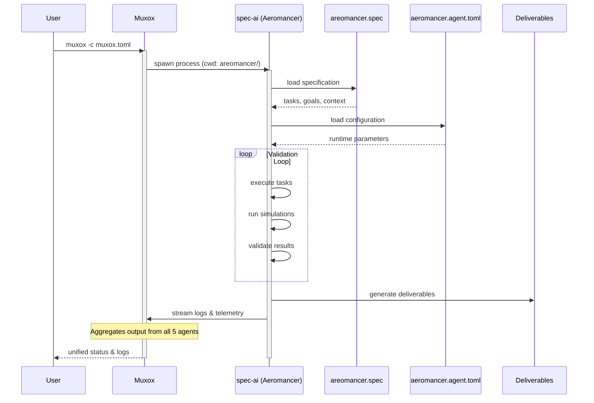

# SMENOS Architecture
## *The Structure of the Swarm*

---

## Overview

SMENOS employs a two-tier orchestration architecture: **muxox** serves as the swarm coordinator, while **spec-ai** provides the individual agent runtime. This separation enables autonomous operation of each specialist while maintaining synchronized oversight of the collective.

```
muxox: The Swarm Conductor
    ├── Coordinates concurrent execution
    ├── Manages inter-agent communication channels
    ├── Aggregates logs and telemetry
    └── Provides unified control surface

spec-ai: The Agent Runtime
    ├── Interprets specification files (.spec)
    ├── Loads agent configuration (.agent.toml)
    ├── Executes validation protocols
    └── Delivers structured results
```

---

## System Topology

```mermaid
graph TB
    subgraph "SMENOS Control Layer"
        MUXOX[muxox<br/>Service Orchestrator]
    end

    subgraph "Aeromancer — Wind-Reader"
        A1[spec-ai runtime]
        A2[areomancer.spec<br/>atmospheric intuition model]
        A3[aeromancer.agent.toml<br/>perception config]
        A1 -->|interprets| A2
        A1 -->|configured by| A3
    end

    subgraph "Emberwright — Flame-Shaper"
        E1[spec-ai runtime]
        E2[emberwrite.spec<br/>exotic-alloy protocol]
        E3[emberwrite.agent.toml<br/>forge config]
        E1 -->|interprets| E2
        E1 -->|configured by| E3
    end

    subgraph "Quantum Diver — Layer-Walker"
        Q1[spec-ai runtime]
        Q2[quantum-diver.spec<br/>reality-interface protocol]
        Q3[quantum-diver.agent.toml<br/>transition config]
        Q1 -->|interprets| Q2
        Q1 -->|configured by| Q3
    end

    subgraph "Relic Hacker — Machine-Whisperer"
        R1[spec-ai runtime]
        R2[relic-hacker.spec<br/>artifact-reclamation protocol]
        R3[relic-hacker.agent.toml<br/>interface config]
        R1 -->|interprets| R2
        R1 -->|configured by| R3
    end

    subgraph "Whispering Cartographer — Path-Dreamer"
        W1[spec-ai runtime]
        W2[whispering-cartographer.spec<br/>cognitive-mapping framework]
        W3[whispering-cartographer.agent.toml<br/>map-genesis config]
        W1 -->|interprets| W2
        W1 -->|configured by| W3
    end

    MUXOX -->|spawns & monitors| A1
    MUXOX -->|spawns & monitors| E1
    MUXOX -->|spawns & monitors| Q1
    MUXOX -->|spawns & monitors| R1
    MUXOX -->|spawns & monitors| W1

    A1 -.->|logs & telemetry| MUXOX
    E1 -.->|logs & telemetry| MUXOX
    Q1 -.->|logs & telemetry| MUXOX
    R1 -.->|logs & telemetry| MUXOX
    W1 -.->|logs & telemetry| MUXOX

    style MUXOX fill:#2d3748,stroke:#4299e1,stroke-width:3px,color:#fff
    style A1 fill:#1a365d,stroke:#63b3ed,stroke-width:2px,color:#fff
    style E1 fill:#742a2a,stroke:#fc8181,stroke-width:2px,color:#fff
    style Q1 fill:#2d3748,stroke:#9f7aea,stroke-width:2px,color:#fff
    style R1 fill:#1c4532,stroke:#68d391,stroke-width:2px,color:#fff
    style W1 fill:#3c366b,stroke:#b794f4,stroke-width:2px,color:#fff
```



---

## Component Roles

### muxox — *The Multiplexed Orchestrator*

**Purpose:** Coordinate concurrent execution of all five specialist agents while maintaining isolation, logging, and control.

**Responsibilities:**
- **Process Management**: Spawns and monitors each `spec-ai` instance
- **Service Isolation**: Each agent runs in its own working directory with independent context
- **Log Aggregation**: Captures output from all agents (5000-line capacity per service)
- **Lifecycle Control**: Handles startup, shutdown, restart, and failure recovery
- **Unified Interface**: Provides a single control surface for the entire swarm

**Configuration:** Defined in `muxox.toml`

```toml
[[service]]
name = "Aeromancer"
cmd = "spec-ai run areomancer.spec -c aeromancer.agent.toml"
cwd = "areomancer"
log_capacity = 5000
```

Each service entry specifies:
- `name`: Human-readable identifier
- `cmd`: The spec-ai invocation with spec file and config
- `cwd`: Working directory (provides file isolation)
- `log_capacity`: Buffer size for output capture

---

### spec-ai — *The Agent Runtime*

**Purpose:** Execute individual agent protocols based on declarative specifications.

**Responsibilities:**
- **Spec Interpretation**: Parse `.spec` files to understand agent goals, tasks, and deliverables
- **Configuration Loading**: Apply agent-specific settings from `.agent.toml` files
- **Protocol Execution**: Run validation loops, simulations, and testing scenarios
- **Result Delivery**: Generate structured output for deliverables
- **State Management**: Track agent progress through specification milestones

**Invocation Pattern:**
```bash
spec-ai run <spec-file> -c <config-file>
```

**Inputs:**
1. **Specification File** (`.spec`): Defines the agent's purpose, goals, tasks, and expected deliverables
   - Written in declarative format (TOML/similar)
   - Describes *what* the agent should accomplish
   - Example: `aeromancer.spec` defines atmospheric perception modeling tasks

2. **Configuration File** (`.agent.toml`): Agent-specific runtime parameters
   - Model selection, API keys, resource limits
   - Describes *how* the agent operates
   - Example: `aeromancer.agent.toml` configures perception pipeline settings

---

## Data Flow



---

## Execution Model

### Sequential Startup
1. User invokes `muxox -c muxox.toml`
2. Muxox reads service definitions
3. For each service, muxox:
   - Changes to the specified working directory
   - Spawns the `spec-ai` process with arguments
   - Establishes log capture pipeline
   - Registers the service for monitoring

### Concurrent Operation
- All five agents run simultaneously
- Each agent operates independently within its domain
- Muxox maintains oversight but does not interfere with agent logic
- Logs are aggregated but execution is parallel

### Failure Handling
- If an agent crashes, muxox detects the failure
- Logs are preserved (up to `log_capacity`)
- Muxox can restart failed services
- Other agents continue unaffected (isolation)

---

## Directory Structure

```
smenos/
├── muxox.toml                      # Orchestrator configuration
│
├── areomancer/                     # Aeromancer workspace
│   ├── aeromancer.agent.toml       # Agent runtime config
│   └── areomancer.spec             # Atmospheric intuition spec
│
├── emberwright/                    # Emberwright workspace
│   ├── emberwrite.agent.toml       # Agent runtime config
│   └── emberwrite.spec             # Exotic-alloy forge spec
│
├── quantum-diver/                  # Quantum Diver workspace
│   ├── quantum-diver.agent.toml    # Agent runtime config
│   └── quantum-diver.spec          # Reality-interface spec
│
├── relic-hacker/                   # Relic Hacker workspace
│   ├── relic-hacker.agent.toml     # Agent runtime config
│   └── relic-hacker.spec           # Artifact-reclamation spec
│
└── whispering-cartographer/        # Whispering Cartographer workspace
    ├── whispering-cartographer.agent.toml  # Agent runtime config
    └── whispering-cartographer.spec        # Cognitive-mapping spec
```

Each agent directory is self-contained:
- Isolated working directory for file operations
- Spec file defines the agent's purpose and tasks
- Config file provides runtime parameters
- Agent output and artifacts remain within the directory

---

## Inter-Agent Communication

**Current State:** Agents operate independently with no direct communication.

**Future Considerations:**
- Shared message bus for inter-agent coordination
- Protocol for requesting assistance from other specialists
- Shared data layer for map updates, material specifications, etc.
- Event-driven triggers (e.g., Cartographer detects anomaly → Quantum Diver investigates)

**Design Principle:** Maintain autonomy while enabling collaboration. The σμήνος moves as one not through rigid coupling, but through shared awareness of a common objective.

---

## Observability

### Logging
- Each agent's stdout/stderr captured by muxox
- 5000-line rolling buffer per agent
- Unified view of all agent activity
- Searchable, filterable log aggregation

### Telemetry
- Agent progress through specification tasks
- Validation results (pass/fail for each deliverable)
- Resource utilization per agent
- Timing metrics for task completion

### Debugging
- Individual agent logs can be inspected separately
- Failed validations include context and error details
- Spec files are version-controlled for reproducibility
- Config files can be modified without changing code

---

## Scaling Considerations

**Horizontal Scaling:**
- Additional agents can be added by creating new directories with spec/config files
- Muxox configuration grows linearly with new `[[service]]` blocks
- No architectural changes required to expand the swarm

**Resource Isolation:**
- Each spec-ai process is independent (memory, CPU)
- Working directory isolation prevents file conflicts
- Log capacity limits prevent unbounded memory growth

**Failure Isolation:**
- One agent failure does not cascade
- Muxox continues managing healthy agents
- Restart policies can be applied per-agent

---

## Philosophy

This architecture embodies the dual nature of SMENOS:

**Autonomy:** Each agent is a complete, self-contained specialist. They carry their own knowledge (spec), their own configuration (config), and operate within their own domain (working directory). Like birds in a flock, they are not puppets—they are individual actors.

**Emergence:** Yet through muxox, they form something greater. The orchestrator does not command; it coordinates. It provides the infrastructure for the swarm to exist as a collective while preserving the independence that makes each specialist exceptional.

The σμήνος does not fly in formation because they are forced to. They fly in formation because the architecture makes it natural.

---

*"Architecture is frozen governance. We design systems that encode our values. SMENOS values autonomy, specialization, and emergent collaboration. The architecture reflects this: loosely coupled, independently capable, collectively powerful."*

— SMENOS Technical Principles
